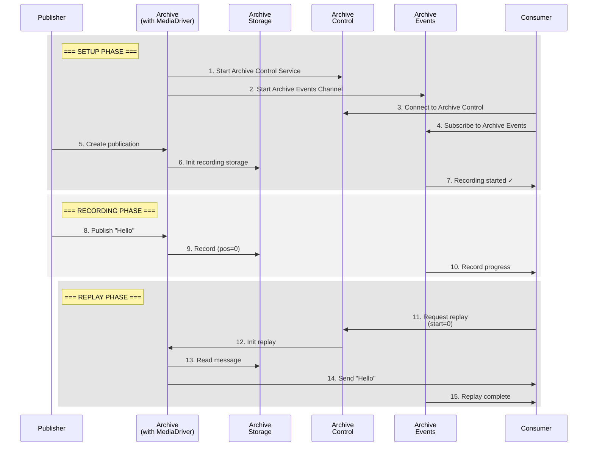

# Aeron Archive Example Project

This project demonstrates Aeron's archive messaging pattern, where publishers and consumers communicate through an Aeron Archive service. Each component runs as an isolated node with its own Media Driver, communicating over UDP to simulate real-world distributed systems.

## Architecture Overview
Each Aeron entity runs on a dedicated host with its own Media Driver, with the Archive service mediating communication:

```
[Host: 172.16.0.4]              [Host: 172.16.0.2]              [Host: 172.16.0.3]           
┌─────────────────┐             ┌─────────────────┐             ┌─────────────────┐          
│    Publisher    │             │    Archive      │             │    Consumer     │          
│                 │  Recording  │                 │   Replay    │                 │          
│  ┌──────────┐  │ ──────────> │  ┌──────────┐  │ ──────────> │  ┌──────────┐  │          
│  │  Media   │  │             │  │  Media   │  │             │  │  Media   │  │          
│  │  Driver  │  │   Control   │  │  Driver  │  │   Events    │  │  Driver  │  │          
│  └──────────┘  │ <──────────>│  └──────────┘  │ ──────────> │  └──────────┘  │          
└─────────────────┘             └─────────────────┘             └─────────────────┘          
```

Key architectural points:
- Archive service mediates all communication
- Each component has its own embedded Media Driver
- Multiple UDP channels for different purposes:
   - Recording channel for message persistence
   - Control channel for Archive commands
   - Events channel for status updates
   - Replay channel for message retrieval

### Archive Pattern
The following sequence diagram details the component interactions:



## Communication Design

### Archive Service
The Archive service acts as the central component:
- Records messages from the Publisher
- Manages message storage
- Handles replay requests from the Consumer
- Provides control and event channels for coordination

Key configuration:
```java
// Archive Control channel for commands
String controlChannel = "aeron:udp?endpoint=172.16.0.2:8010";
// Archive Events channel for status updates
String eventsChannel = "aeron:udp?endpoint=172.16.0.2:8020";
// Recording channel for data
String recordingChannel = "aeron:udp?endpoint=172.16.0.2:40456";
```

### Publisher Service
The Publisher sends messages to the Archive for recording:
- Connects to Archive's recording endpoint
- Publishes messages for archival
- Uses its own embedded Media Driver

Key configuration:
```java
// Connect to Archive's recording endpoint
String channel = "aeron:udp?endpoint=172.16.0.2:40456";
final int streamId = 10;

// Create publication
final Publication publication = aeron.addPublication(channel, streamId);
```

### Consumer Service
The Consumer interacts with the Archive to:
- Connect to Archive control channel
- Subscribe to Archive events
- Request and receive message replays
- Monitor recording progress

Key configuration:
```java
// Connect to Archive control
AeronArchive.Context archiveCtx = new AeronArchive.Context()
    .controlRequestChannel("aeron:udp?endpoint=172.16.0.2:8010")
    .controlResponseChannel("aeron:udp?endpoint=172.16.0.3:8020");

// Subscribe to events
Subscription eventsSubscription = aeron.addSubscription(
    "aeron:udp?endpoint=172.16.0.2:8020",
    101
);
```

### Channel Configuration

| Component | URI Pattern | Stream ID | Purpose |
|-----------|------------|-----------|----------|
| Archive Control | aeron:udp?endpoint=172.16.0.2:8010 | 100 | External control commands |
| Archive Events | aeron:udp?endpoint=172.16.0.2:8020 | 101 | Recording status events |
| Recording Channel | aeron:udp?endpoint=172.16.0.2:40456 | 10 | Message recording |
| Replay Channel | aeron:udp?endpoint=172.16.0.3:40456 | 10 | Message replay |

## Running with Docker

The project uses Docker Compose to simulate a distributed environment:
```bash
docker-compose up --build
```

## Important Configuration Notes

### Media Driver Setup
Each container runs its own Media Driver to ensure proper isolation:
```java
MediaDriver.Context driverCtx = new MediaDriver.Context()
    .dirDeleteOnStart(true);
MediaDriver driver = MediaDriver.launch(driverCtx);
```

### Container Health Checks
Health checks ensure proper startup sequencing:
```yaml
healthcheck:
  test: [ "CMD-SHELL", "ps aux | grep -v grep | grep -q 'AeronArchive' && echo 'Archive running' || exit 1" ]
  interval: 5s
  timeout: 3s
  retries: 10
```

### Shared Memory
Each container needs its own shared memory space:
```yaml
volumes:
  - type: tmpfs
    target: /dev/shm
```

## Troubleshooting Guide

### Common Issues

1. **Media Driver Startup Failures**
   - Ensure each container has its own tmpfs volume
   - Check process has proper permissions
   - Verify no conflicting Media Driver instances

2. **Archive Communication Issues**
   - Verify correct UDP endpoints for all channels
   - Check network isolation in Docker
   - Ensure streamIds match between components
   - Verify Archive control and event channels

3. **Container Dependencies**
   - Archive must start first
   - Consumer needs Archive control channel ready
   - Health checks must verify process presence

4. **Process Requirements**
   - Container needs `procps` for health checks
   - Java requires `--add-opens java.base/sun.nio.ch=ALL-UNNAMED`
   - Proper permissions for shared memory access

## Project Structure
```
src/
  ├── main/
  │   └── java/
  │       └── org/
  │           └── starquake/
  │               ├── archive/         # Archive service
  │               ├── publisher/       # Message publisher
  │               └── consumer/        # Message consumer/replayer
  └── test/
```

## Prerequisites
- Java 23 (Amazon Corretto)
- Docker
- Gradle

## Building
```bash
./gradlew clean shadowJar
```

## Known Issues and Limitations
- Single publisher/consumer setup
- Basic error handling
- Requires Docker for distributed setup

## Contributing
Feel free to submit issues and enhancement requests!

## License
[Add your license information here]